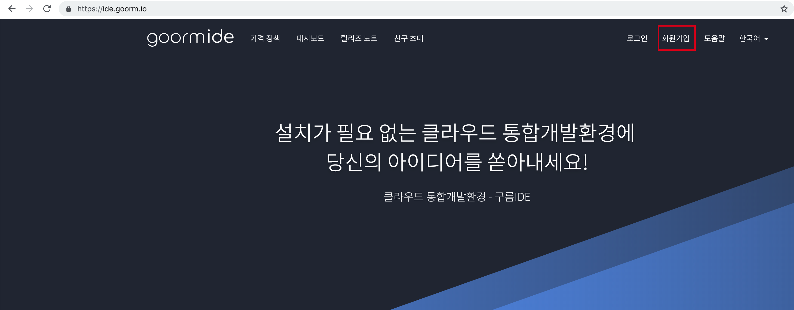
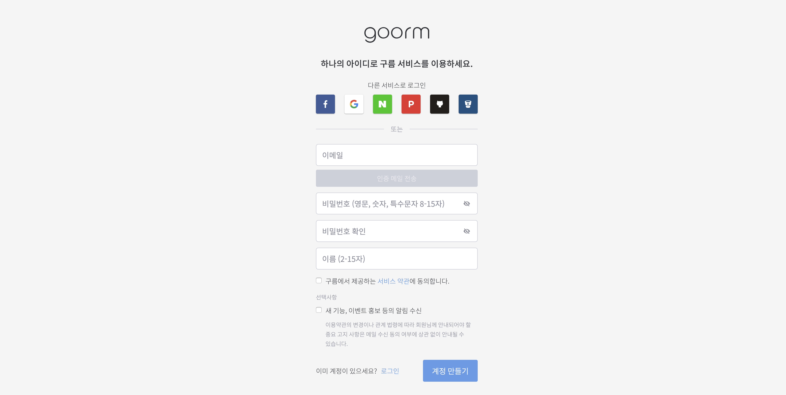
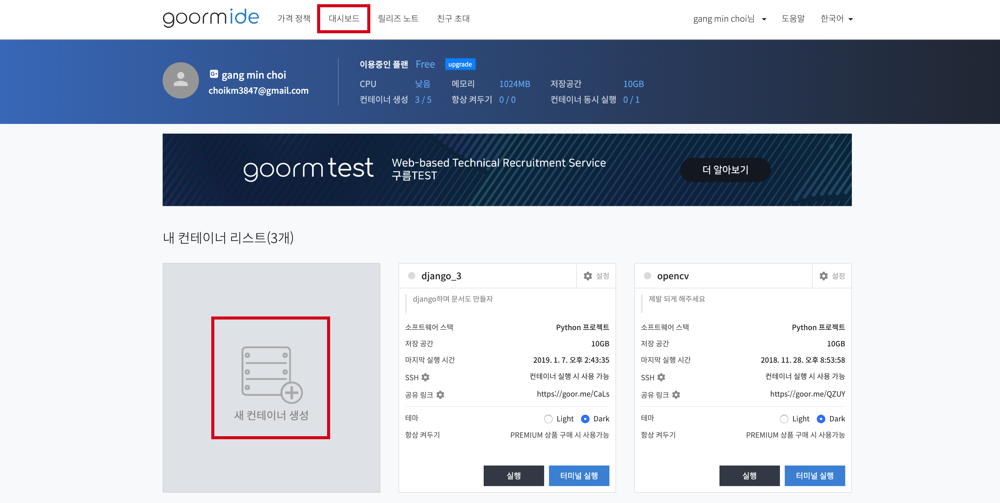
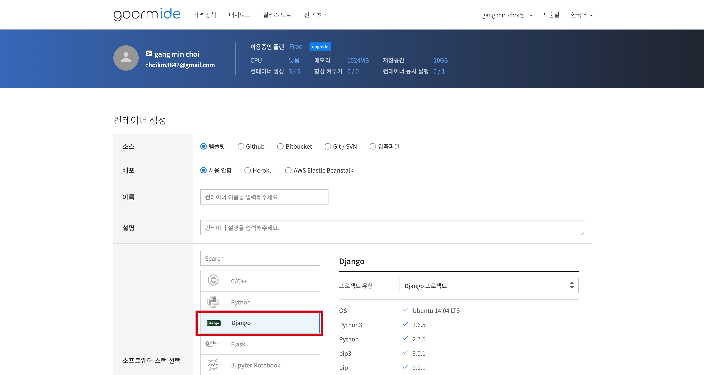
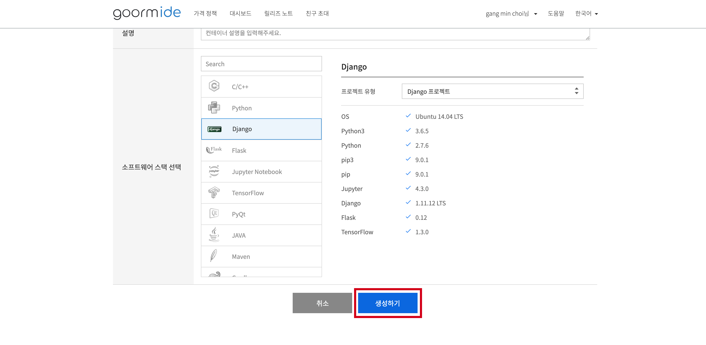
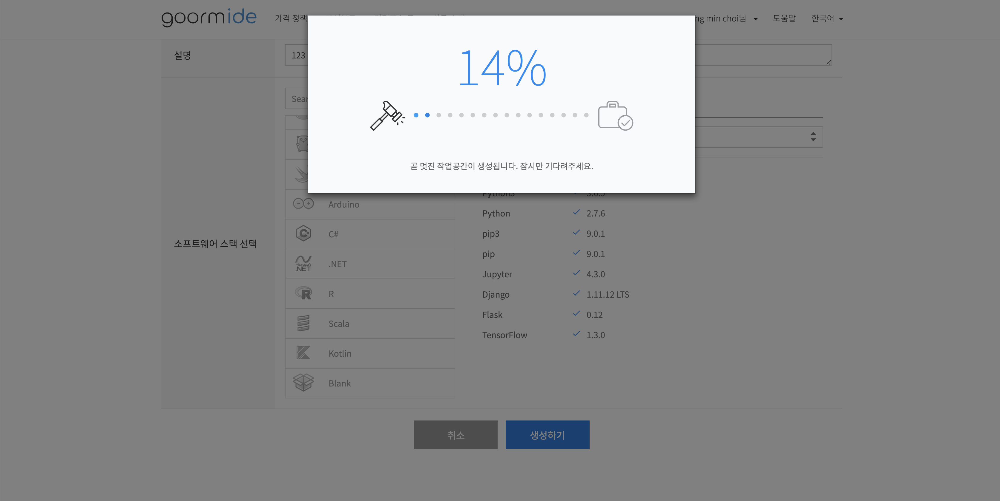
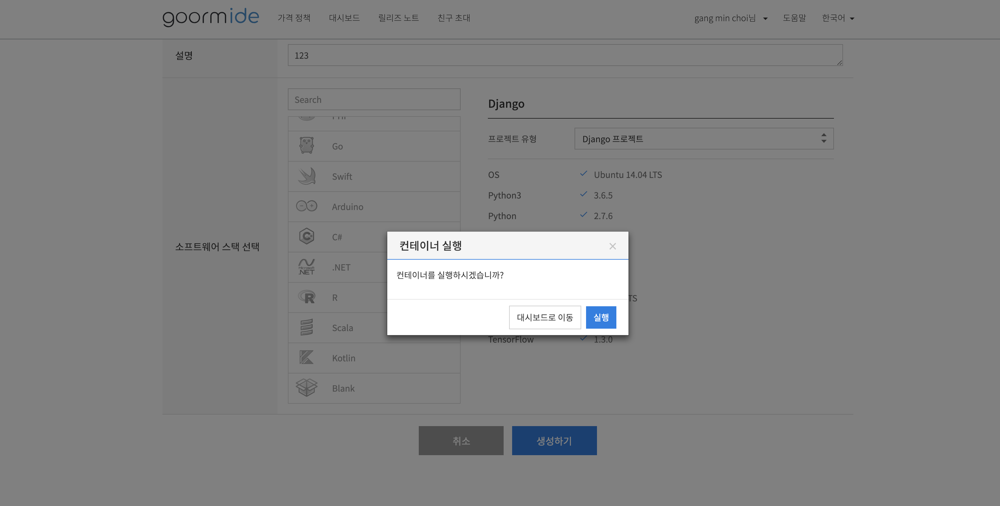
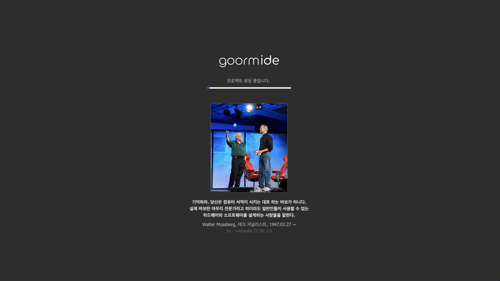
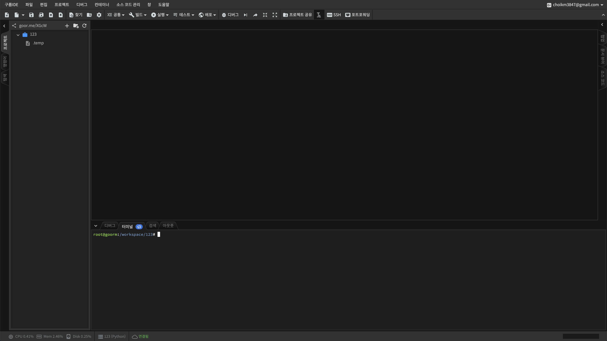

# 구름 IDE에서 코딩하자

## 여러분은 크롬 위에서 코딩을 할 수 있게 됩니다
### 구름IDE 완전 편해요 짱짱
#### [구름 IDE 홈페이지](https://ide.goorm.io)에 들어갑니다

#### 회원가입 합시다
자신의 SNS 계정으로 회원가입합니다  

#### 대시보드 가서 자신의 컨테이너 확인
자신이 진행한 컨테이너(프로젝트)를 볼 수 있습니다.  
Free tier의 경우 5개의 컨테이너를 만들 수 있습니다.  
[추가 결제](https://ide.goorm.io/pricing)하면 다양한 기능을 추가할 수 있습니다  

#### 새 컨테이너 만들기

여러 기술스택을 선택할 수 있습니다.  
저는 Django 프로젝트를 진행합니다.  
#### 컨테이너 생성하기

#### 컨테이너 로딩창

#### 컨테이너 실행하기

#### 준비완료! 프로젝트를 시작합니다

#### [장고 프로젝트 시작하기](https://github.com/kei01138/djangoProject)